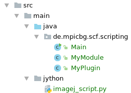
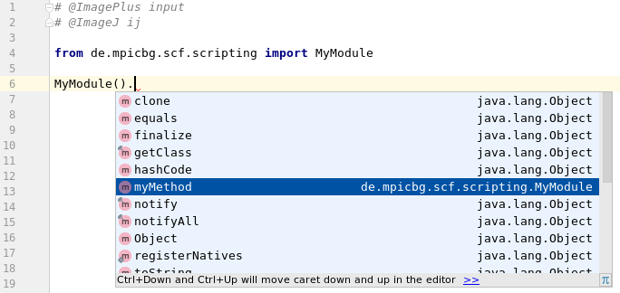
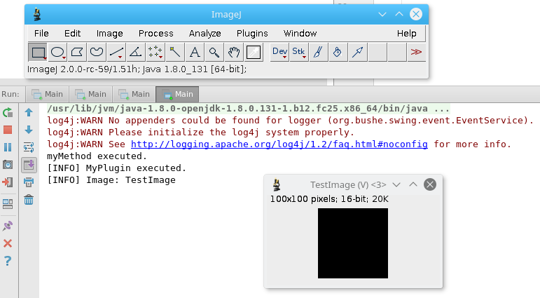

# How to develop, deploy and run ImageJ/Fiji scripts and Java plugins within your IDE simultaneously

Did you ever work on a Jython script for ImageJ and in parallel on a Java based ImageJ Plugin?
This is a bit annoying, right? After every change in the Java code, you need to deploy the jar file to your ImageJ/Fiji installation. Afterwards, you need to restart ImageJ, load the script, run it. Then you realise, that you just forgot to remove these 10 billion debug traces and the procedure starts from the beginning.

With _ImageJ2_, there is a way to edit Jython scripts and Java code in parallel _within your IDE_ and run it together with a single click!

I guess the following will work with any IDE such as Eclipse or Intellij. I tested with Intellij 2017.01 with Python support installed.

The [project we are talking about](https://github.com/haesleinhuepf/run_jython_scripts_from_ide) looks like this:



## MyPlugin.java
This is a very minimal ImageJ2 plugin I'm using just to demonstrate that the plugin is executed and runs on the right image:

```java
@Plugin(type = Command.class, menuPath = "Plugins>MyPlugin")
public class MyPlugin implements Command {
    @Parameter
    ImagePlus input;

    @Parameter
    ImageJ ij;

    @Override
    public void run() {
        ij.log().info("MyPlugin executed.");
        ij.log().info("Image: " + input.getTitle());
    }
}
```
 
## MyModule.java
Furthermore, a minimal Java Class should allow us later to show the capabilities of the IDEs auto completion functionality:

```java
public class MyModule {
    public void myMethod() {
        System.out.println("myMethod executed.");
    }
}
```

## imagej_script.py
This is the actual ImageJ jython script. The first part executes `myMethod` of `MyModule`. The second part executes `MyPlugin` in ImageJ1 style.

```python
# @ImagePlus input
# @ImageJ ij
from de.mpicbg.scf.scripting import MyModule

# work with classes and methods from java directory
MyModule().myMethod()

# execute a plugin
from ij import IJ;
input.show()
IJ.run(input, "MyPlugin", "")
```

When writing this script, I already saw that my IDE allows auto completion:



**AUTO COMPLETION! Isn't that already awesome?**

## Main.java
How do we run the Jython script from within the IDE? And how can we ensure that my classes like `MyModule` are compiled and available during runtime?
The answer delivers the `ScriptingService` of ImageJ2. The whole main function which runs ImageJ, creates a test image and calls the script looks like this:

```java
public class Main {
    public static void main(String... args) throws FileNotFoundException, ScriptException {
        // start ImageJ
        ImageJ ij = new ImageJ();
        ij.ui().showUI();

        // get some image to process
        Img<ShortType> testImage = ArrayImgs.shorts(new long[]{100, 100});
        ImagePlus imp = ImageJFunctions.wrap(testImage, "TestImage");

        // run the script, hand over image and imagej instances
        ij.script().run(new File("src/main/jython/imagej_script.py"), false, new Object[]{"input", imp, "ij", ij});

    }
}
```

The output together with the opening windows look like that:



`myMethod` is executed, just like `MyPlugin` and the plugin accesses the right image. And all that just by running the `main` function. I'm not yet fully aware of all the awesome thing I can do now from within my IDE! Awesome!

Feel free to try the procedure with your IDE. Checkout the (full code)[https://github.com/haesleinhuepf/run_jython_scripts_from_ide].

Feedback welcome: rhaase AT mpi-cbg.de

Happy coding!
